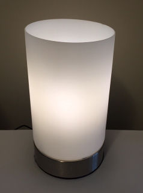
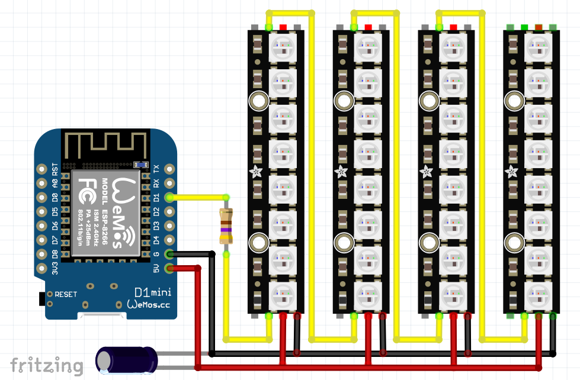

# NeoLamp
> WiFi IoT Lamp containing Adafruit NeoPixels.

## Introduction

This project involves creating a simple WiFi [IoT](https://en.wikipedia.org/wiki/Internet_of_things) Lamp using [Adafruit](https://www.adafruit.com/) [NeoPixels](https://www.adafruit.com/category/168).

## Components

| Item | Count |
| ---- | ----- |
| [WiFi Mini ESP8266 Main Board](https://www.jaycar.com.au/wifi-mini-esp8266-main-board/p/XC3802) `*` | 1 |
| [NeoPixel Stick - 8 x 5050 RGBW LEDs (Warm White)](https://www.adafruit.com/product/2867) | 4 |
| 470 ohm Resistor | 1 |
| 1000 uF Capacitor, 6.3V or higher | 1 |
| [Panel Mount Extension USB Cable - Micro B Male to Micro B Female](https://www.adafruit.com/product/3258) | 1 |
| Basic Lamp with frosted glass suitable for hacking | 1 |

`*` Note that the Arduino Board listed above can be replaced with any board that is compatable with `LOLIN(WEMOS) D1 R2 & mini` in the Arduino IDE.

## Assembly Instructions

1) Remove the base and all electrical components from the Lamp including the power cable.  The final product uses USB power and **not** the mains power supply.
2) Install the [Panel Mount Extension USB Cable - Micro B Male to Micro B Female](https://www.adafruit.com/product/3258) where the power cable used to enter the base.
3) Build the circuit below with suitable allowance in the wires to wrap around the post used for the bulb support.  Note that this follows the [NeoPixel Best Practices](https://learn.adafruit.com/adafruit-neopixel-uberguide/best-practices).

4) Install the software in the [neolamp](./neolamp) folder using the Arduino IDE and test.
5) Mount the Neopixels wrapped around the post used as the bulb support.
6) Push the USB cable fully into the lamp before attaching to the main board.  The USB plug can be delicate and it can be safer to *pull* the device into the lamp rather than pushing it and bending/snapping the USB device.
7) Test using the newly installed device with USB power into the base of the lamp!
